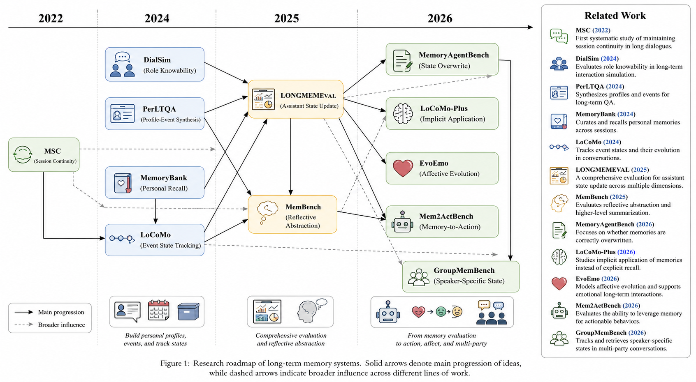

# Awesome Agent Memory Benchmark

中文 | [English](README.md)

虽然通用 LLM 的 Agent 能力正在快速增强，但在具体业务场景中，Memory 的使用体验仍然是决定 Agent 能否稳定完成任务的关键。于是，做业务时自然绕不开几个问题：什么样的 Agent Memory System 才算好？应该如何评估它？现有 Agent Memory Benchmark 又是如何构建的？本文试图回答这些问题：梳理近几年 Agent Memory Benchmark 的代表性工作，总结它们的评测目标、能力演进与数据构造方法。

这是一个整理 **LLM Agent 长期记忆 benchmark** 的双语资料库，覆盖从早期 session continuity、personal recall，到 longitudinal state tracking、implicit memory、multi-party memory 和 memory-to-action 的研究脉络。

## 总览图

*Agent memory benchmark 研究路线图。*

## 项目定位

长期记忆正在成为 LLM agent 的核心能力。一个有用的 memory system 不应该只是从历史里检索旧事实，而应该能长期维护用户、任务、关系、群体和场景的当前状态。

这个 repo 的核心判断是：

> Agent memory benchmark 的演进，本质是从 factual recall 走向 longitudinal state tracking。

早期 benchmark 主要问：模型能不能找回历史事实。近期 benchmark 则进一步问：模型能不能跨 session 整合证据、理解时间顺序、覆盖旧状态、应用隐式约束、区分不同 speaker 的状态，并把记忆转成可执行行动。

## 研究发展阶段

从研究问题看，Agent Memory Benchmark 的发展不是简单地把上下文变长，而是逐步把“记住历史”拆解成更细的系统能力：先解决跨 session 不失忆，再测试个人事实和事件能否被找回，随后进入跨 session 推理、状态更新、隐式约束、多主体归属和行动执行等更复杂场景。下面的阶段划分可以帮助我们理解每类 benchmark 主要在补足哪一块能力缺口。

| 阶段 | 核心问题 | 代表 benchmark |
|---|---|---|
| Session continuity | Agent 能不能跨 session 不失忆？ | MSC |
| Personal factual memory | Agent 能不能记住用户事实、偏好、关系和事件？ | MemoryBank、PerLTQA |
| Long-context / cross-session reasoning | Agent 能不能在长历史中做多跳、时间和不可回答推理？ | LoCoMo、LongMemEval |
| Dynamic state maintenance | Agent 能不能处理状态变化、冲突、覆盖和遗忘？ | LongMemEval、MemoryAgentBench、EvoEmo |
| Implicit and abstract state | Agent 能不能从间接 cue 中抽象目标、偏好、情绪或画像？ | LoCoMo-Plus、MemBench、EvoEmo |
| Context-conditioned state use | Agent 能不能按 speaker、任务、群聊上下文或工具 schema 使用状态？ | GroupMemBench、Mem2ActBench |

## 能力分类

如果说“研究发展阶段”展示的是时间线，那么“能力分类”更像是评测维度的拆解。同一个 benchmark 往往不只测试一种能力，例如 LongMemEval 同时涉及证据整合、时间推理、状态更新和拒答；GroupMemBench 则同时涉及多人对话、speaker 归属和跨证据推理。按能力重新分类，有助于判断一个 Agent Memory System 到底在哪些环节强、在哪些环节容易失效。

| 子能力 | 解决的问题 | 代表 benchmark |
|---|---|---|
| Evidence integration | 分散证据怎么拼成状态 | LongMemEval、LoCoMo、GroupMemBench |
| Temporal grounding | 哪个状态更早、更晚、过期或仍然有效 | LongMemEval、LoCoMo、DialSim |
| State update / overwrite | 新旧事实冲突时，当前状态是什么 | LongMemEval、MemoryAgentBench、EvoEmo |
| Implicit constraint application | 没明说的目标或约束，未来能不能被应用 | LoCoMo-Plus |
| State abstraction | 如何从事件中归纳偏好、情绪和画像 | MemBench、EvoEmo、PerLTQA |
| Speaker-specific state | 应该使用谁的状态、信念、任务或偏好 | GroupMemBench |
| Memory-to-action | 记忆能不能转成工具参数或行动 | Mem2ActBench |

## 有价值的 Benchmark 构造方法

这些工作的价值不只在于提出了新的评测集，更在于它们提供了一套可复用的数据构造范式。相比“让 LLM 批量生成 QA”，更可靠的做法通常是先设计可控的 latent state、事件链或冲突链，再围绕这些状态生成对话和问题，最后用检索 baseline、no-memory discriminator 或人工审核过滤掉泄漏答案、过于简单或不可解的样本。

比如，如果要测试“用户当前有效地址”这一类状态，不能只让 LLM 随机生成一段历史对话和一个问题，而应该先定义状态演化链：用户最初住在北京，后来计划搬去上海，最终已经搬到上海，中间还可能短期出差去深圳。然后再围绕这些状态生成多 session 对话，并构造问题“现在寄材料应该寄到哪里？”。这样的样本才能真正测试模型是否理解状态更新和时间有效性，而不是只靠关键词匹配历史里出现过的地名。

| 方法 | 来自哪些工作 | 值得借鉴点 |
|---|---|---|
| 先建 latent state / event graph，再生成对话 | LoCoMo、GroupMemBench | 保证 gold state 和证据可控 |
| Cue-trigger 成对构造 | LoCoMo-Plus | 测试低表面相似条件下的隐式记忆激活 |
| Solve-Judge-Refine 难题筛选 | GroupMemBench | 保留可解但有挑战的问题 |
| No-memory discriminator | Mem2ActBench | 删除 query 本身泄漏答案的样本 |
| Conflict / update chain | LongMemEval、MemoryAgentBench、EvoEmo、Mem2ActBench | 测当前有效状态，而不是历史中是否出现过 |
| 真实/半真实数据改造成 memory 格式 | LongMemEval、MemBench、Mem2ActBench | 在保持可控证据的同时提高真实感 |
| 人工写/审核核心问题 | LongMemEval、EvoEmo | 在质量和规模之间取得平衡 |
| 语义过滤降低表面匹配 | LoCoMo-Plus | 避免 benchmark 变成关键词检索 |
| 检索 baseline 反向筛题 | LoCoMo-Plus、GroupMemBench、Mem2ActBench | 删除 BM25 或 embedding retrieval 太容易做对的题 |
| Hard negatives / unanswerable questions | LoCoMo、LongMemEval、DialSim、GroupMemBench | 测 abstention，减少编造答案 |
| 保留结构化 metadata | GroupMemBench、DialSim、LoCoMo | 支持 speaker-aware、thread-aware、time-aware evaluation |
| Event-level / state-level evaluation | LoCoMo、EvoEmo | 评估答案或总结是否覆盖关键状态变化 |
| 多粒度任务组合 | MemBench、MemoryAgentBench | 避免只优化单一 QA 形式 |

## 推荐的 Benchmark 设计配方

如果要构造新的 agent memory benchmark，最值得复用的配方是：

1. 定义 latent state graph，包括用户、speaker、事件、时间、任务、偏好、冲突和有效期。
2. 根据 state graph 生成多 session 对话。
3. 加入 cue-trigger pair，测试隐式记忆应用。
4. 加入 conflict chain，测试当前状态追踪。
5. 加入 unanswerable 和 hard-negative 样本。
6. 用 no-memory、BM25、embedding 和强 LLM baseline 过滤样本。
7. 保留 speaker、timestamp、session id、topic、reply-to、state id、evidence id 等 metadata。
8. 同时评估 answer accuracy、evidence recall、state accuracy、abstention accuracy、tool-parameter accuracy 和 state-level summary quality。

## Benchmark 列表

回到文章开头的问题：什么样的 Agent Memory System 才算好？从这些 benchmark 可以看到，答案并不是“能存更多历史”或“能检索更长上下文”这么简单。一个好的 Agent Memory System 至少应该能在长期交互中保持 session 连续性，准确找回个人事实和事件，理解时间顺序和状态覆盖，识别隐式约束与抽象用户状态，在多人场景中区分状态归属，并在需要时把记忆转化为回答或行动。下面的 benchmark 列表按研究脉络梳理每篇工作的评测目标、构造方式和主要价值。

### MSC: Beyond Goldfish Memory

- 时间：2022
- 会议：ACL
- 论文：https://aclanthology.org/2022.acl-long.356/
- 关注能力：长期开放域对话中的 session continuity

MSC 是早期系统研究长期开放域对话记忆的数据集。它从 PersonaChat 风格的对话出发，构造多 session 对话，评估模型能否在后续 session 中自然复用历史信息。

价值：MSC 把“长期对话不失忆”变成了一个明确的评测问题。它主要测试模型能否维持跨 session 连续性。

### MemoryBank

- 时间：2024
- 会议：AAAI
- 论文：https://arxiv.org/abs/2305.10250
- 代码：https://github.com/zhongwanjun/MemoryBank-SiliconFriend
- 关注能力：personal recall 和 AI companion memory

MemoryBank 面向 AI companion 场景，评估系统能否在长期陪伴中形成用户记忆。它合成用户多天对话和 probing questions，测试模型能否检索相关记忆、回答历史事实，并生成个性化回复。

价值：MemoryBank 从长上下文对话走向显式 memory system，关注记忆抽取、存储、检索、更新和遗忘。

### PerLTQA

- 时间：2024
- 会议：ACL
- 论文：https://arxiv.org/abs/2402.16288
- 代码：https://github.com/Elvin-Yiming-Du/PerLTQA
- 关注能力：基于语义记忆和情节记忆的个人长期 QA

PerLTQA 为虚拟角色构造 profile、关系、事件和历史对话，并基于这些记忆生成 QA。任务包括 memory classification、memory retrieval 和 memory synthesis。

价值：PerLTQA 明确区分 semantic memory 和 episodic memory，适合研究个人画像、关系网络和事件记忆。

### DialSim

- 时间：2024
- 论文：https://arxiv.org/abs/2406.13144
- 代码：https://github.com/jiho283/DialSim
- 关注能力：长期多人对话中的 role knowability

DialSim 让 agent 在长期多人对话中扮演某个角色，并只能根据该角色在当前时间点应该知道的信息回答问题。

价值：DialSim 引入 role knowability 和 temporal access constraints。Agent 不只要知道发生了什么，还要知道谁在什么时候能知道这件事。

### LoCoMo

- 时间：2024
- 会议：ACL
- 论文：https://arxiv.org/abs/2402.17753
- 代码：https://github.com/snap-research/LoCoMo
- 关注能力：超长对话中的 event state tracking

LoCoMo 基于 persona 和 temporal event graph 构造超长、多 session、多模态对话。任务包括 single-hop、multi-hop、temporal、open-domain、adversarial unanswerable QA，以及 event summarization 和 multimodal dialogue generation。

价值：LoCoMo 的关键方法是先生成 latent event graph，再生成 conversation。这样 gold state、证据、时间顺序和事件演化都更可控。

### LongMemEval

- 时间：2025
- 会议：ICLR
- 论文：https://arxiv.org/abs/2410.10813
- 代码：https://github.com/xiaowu0162/LongMemEval
- 关注能力：长期交互记忆中的 assistant state update

LongMemEval 评估 chat assistant 的长期记忆能力，覆盖 information extraction、multi-session reasoning、temporal reasoning、knowledge update 和 abstention。

价值：LongMemEval 是从 factual recall 走向 longitudinal state tracking 的关键节点。它关注 assistant 是否能在长历史中维护当前有效状态。

### MemBench

- 时间：2025
- 论文：https://arxiv.org/abs/2506.21605
- 代码：https://github.com/import-myself/Membench
- 关注能力：综合 memory evaluation 和 reflective abstraction

MemBench 区分 participation 和 observation 两种场景，也区分 factual memory 和 reflective memory。它评估 answer accuracy、retrieval recall、memory capacity 和 temporal efficiency。

价值：MemBench 不只看 QA 是否答对，也关注 memory system 是否能抽象高层偏好，以及是否能在规模变大后保持效率。

### MemoryAgentBench

- 时间：2026
- 论文：https://arxiv.org/abs/2507.05257
- 代码：https://github.com/HUST-AI-HYZ/MemoryAgentBench
- 关注能力：增量多轮记忆、state overwrite 和 forgetting

MemoryAgentBench 通过多轮交互逐步注入记忆，再评估 retrieval、test-time learning、long-range understanding 和 selective forgetting。

价值：它把遗忘和覆盖作为长期记忆的核心能力。强 memory agent 不应该平等保留所有旧事实，而应该知道哪些事实仍然有效。

### LoCoMo-Plus

- 时间：2026
- 会议：ACL
- 论文：https://aclanthology.org/2026.acl-long.1150/
- 代码：https://github.com/xjtuleeyf/Locomo-Plus
- 关注能力：隐式认知记忆的应用

LoCoMo-Plus 在长对话中插入隐式 cue，并在后续提出低语义相似的 trigger query。它测试 agent 能否应用早先隐含的用户目标、约束或偏好。

价值：它避免任务退化成关键词检索，真正测试隐式记忆能不能被未来场景激活。

### EvoEmo / ES-MemEval

- 时间：2026
- 会议：WWW
- 论文：https://arxiv.org/abs/2602.01885
- 关注能力：长期情感支持中的 affective evolution

EvoEmo 评估对话 agent 能否追踪用户长期变化的情绪状态、压力源、关系和支持需求。

价值：它把 memory benchmark 从事实和偏好扩展到情绪状态、因果事件线和个性化支持。

### Mem2ActBench

- 时间：2026
- 会议：ACL
- 论文：https://aclanthology.org/2026.acl-long.370/
- 代码：https://github.com/Cantaloupe-M/Mem2ActBench
- 关注能力：任务型 agent 中的 memory-to-action

Mem2ActBench 要求 agent 执行工具调用，其中当前 query 省略了关键参数，agent 必须从长期记忆中恢复这些参数。

价值：它把 memory evaluation 从“能不能回答”推进到“能不能行动”，测试用户状态、偏好和约束能否转成正确 tool-call 参数。

### GroupMemBench

- 时间：2026
- 论文：https://arxiv.org/abs/2605.14498
- 代码：https://github.com/UCSB-NLP-Chang/GroupMemBench
- 关注能力：多人对话中的 speaker-specific state

GroupMemBench 评估群聊中的 agent memory。Agent 必须检索和推理属于特定 speaker、任务、线程和群体上下文的状态。

价值：GroupMemBench 说明 group memory 不是更长的 dialogue，而是 speaker-grounded belief tracking。核心难点是避免把 Alice 的状态错用到 Bob 身上。

## 引用说明

本 repo 是研究资料整理。使用相关数据集、代码或 benchmark 设计时，请引用对应原始论文。
